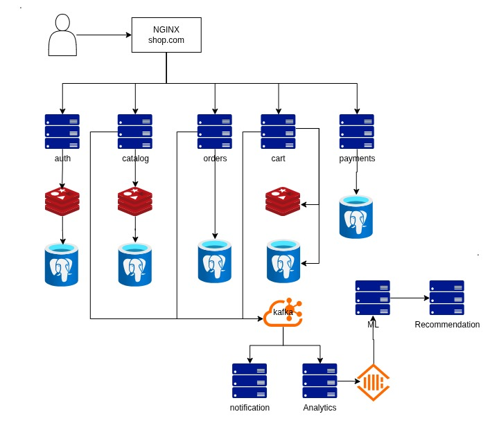

Marketplace

A modern marketplace platform built with a production-oriented backend architecture.

⸻

About

Marketplace — Is a project to develop your own marketplace with a modern and scalable architecture.

The main goal of the project is to create a full-fledged backend system using approaches and technologies used in real commercial projects.

The project is under active development, so the architecture and functionality are gradually expanding.
⸻

Tech Stack

Backend

* Go
* Python
* FastAPI
* Chi
* REST API

Data & Infrastructure

* PostgreSQL
* Redis
* Apache Kafka
* ClickHouse
* Docker
* Nginx

⸻

Architecture

The project is based on a microservice architecture, where individual components are responsible for various parts of the system.

The architecture provides:

* Authentication
* Catalog
* Orders
* Inventory
* Analytics
* Recommendations
* Asynchronous communication
* Caching

⸻

Architecture

The project is being developed with a scalable microservice-oriented architecture.

The following diagram represents the planned system architecture and the main interactions between its components.

Note: The architecture is currently under development and may change as the project evolves.

Planned Architecture

  

The architecture includes separate services for authentication, catalog, orders, inventory, analytics and recommendations, as well as infrastructure components for caching, messaging and data processing.

The diagram will be updated as the architecture evolves.

Development

The project is under development.

New services, functions and architectural solutions are added gradually as the project develops.
⸻

Status: In Development